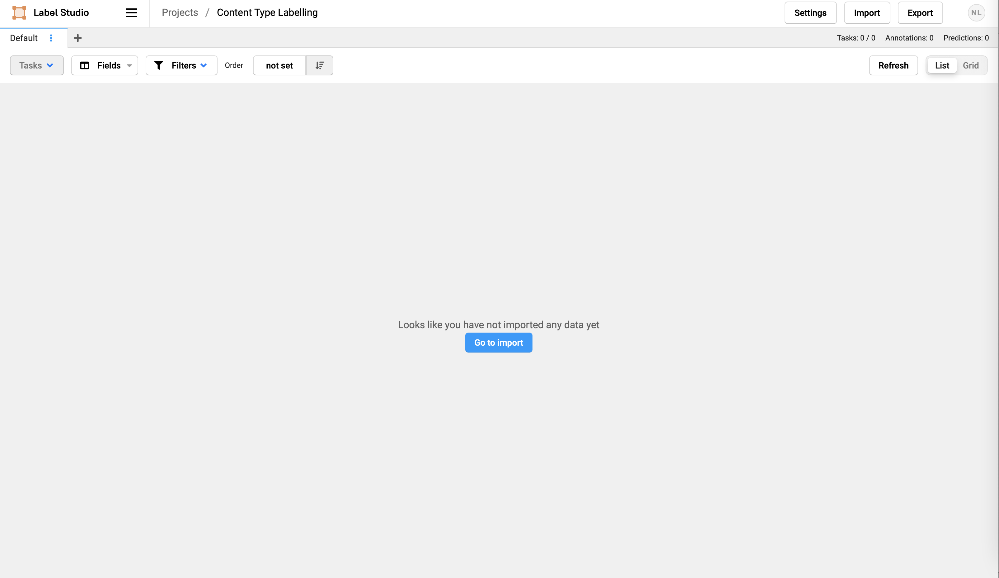

# Content Type Profiling of Data-to-Text Generation Dataset

This repo contains the code and experimental results for the D2T Datasets Content Type Profiling.

**Note:** This repository is to compliment the submitted paper. It will be deleted after conference's anonymity period is over.

## Things that can be done with the code in this repo

1. Train a Multi-Label Content Type classifier with and without Active Learning
    * Without AL
    ```bash
    CUDA_VISIBLE_DEVICES=0 python3 src/al_main.py -dataset mlb -a_class -e_class
    ```
    * With AL
    ```bash
    CUDA_VISIBLE_DEVICES=0 python3 src/al_main.py -dataset mlb -a_class -e_class -do_al -qs qbc -tk 25
    ```

2. Plot Content Type Distribution graphs for different datasets
    ```bash
    CUDA_VISIBLE_DEVICES=0 python3 src/plot_res.py -dataset mlb -a_class -e_class -type gold_ns
    ```

3. Evaluate the performance of NLG systems' output texts on different metrics
    ```bash
    sh run_eval.sh mlb acc 0
    ```

3. Label: Content Type classifier data; and accuracy errors in NLG systems' output texts
    * Use [Label-Studio](https://labelstud.io) to label the data - config saved in [`labdata`](./labdata) (Docker needed)
    ```bash
    docker run -it -p 8080:8080 -v `pwd`/labdata:/label-studio/data heartexlabs/label-studio:latest
    ```

## Directory Structure

* [`sportsett/`](./sportsett): everything used for the sportsett data experiments
    * [`sportsett/data/`](sportsett/data/): contains data/annotations for builidng Content-Type classifier
        * [`sportsett/data/initial`](sportsett/data/initial): contains data for training generation systems
    * [`sportsett/eval/`](sportsett/eval/): contains data/annotations from human evaluation of system generated summaries 
* [`mlb/`](./mlb): everything used for the mlb data experiments
* [`sumtime/`](./sumtime): everything used for the sumtime data experiments
* [`obituary/`](./obituary): everything used for the obituary data experiments

* [`labdata/`](./labdata): folder to store the docker data for labelling app (databse and settings)

* [`eval/`](./eval): contains code for calculating evaluation results

* [`src/`](./src): contains the source code
    * [`al_utils.py`](./src/al_utils.py): contains the functions for active learning
    * [`clf_utils.py`](./src/clf_utils.py): contains the functions for classifier
    * [`bert_utils.py`](./src/bert_utils.py): contains just plain bert classifier (fine-tuned on this data)
    * [`merge_annotated.py`](./src/merge_annotated.py): merges the annotated json file with the already annotated samples in `train.tsv` file
    * [`al_main.py`](./src/al_main.py): contains the main code for classifier and active learning
    * [`abs_sent.py`](src/abs_sent.py): contains the functions for sentence abstracting (using PoS/NER tags)
    * [`plot_res.py`](src/plot_res.py): code for plotting different across dataset graphs 
    * [`rw_plots.py`](src/rw_plots.py): code for plotting grpahs specific to RotoWire and SportSett 

* [`run_first.sh`](run_first.sh): script to run the first time to create the `top_{k}_unlabelled.txt` file.

* [`run_active_learning.sh`](run_active_learning.sh): script to run the after `run_first.sh` is executed once and the `top_{k}_unlabelled.txt` file is created.

* [`plots.sh`](plots.sh): script to plot performance change with change in data.

### Trained Content-Type Classifiers

Download and save the trained models in the respective datasets' folder from [GDrive](https://drive.google.com/drive/folders/1DtB3zv7ahIrb0RmQgIfWk6OX8ST4mUHN?usp=sharing).

## How to Run 

### Step-by-Step

1. Annotate some data and create the `train.tsv`/`valid.tsv` files in `{dataset_name}/data/tsvs` folder.

2. Run to create the `top_{k}_unlabelled.txt` file.
    ```bash
    python3 src/al_main.py -qs qbc -tk 25 -dataset mlb -do_al -a_class
    ```

3. Take the `top_{k}_unlabelled.txt` file from `{dataset_name}/data/txts` folder and annotate it.

4. Save the annotations is `json` format in `{dataset_name}/data/jsons` folder with name `annotations.json`.

5. Run the the following to merge new annotations with the existing ones in `{dataset_name}/data/tsvs/train.tsv` file.
    ```bash
    python3 src/merge_annotated.py -dataset mlb -not_first_run
    ```

6. Now again run the `src/al_main.py` to retrain models on extended data and create new `top_{k}_unlabelled.txt` file.
    ```bash
    python3 src/al_main.py -qs qbc -tk 25 -dataset mlb -do_al -a_class
    ```

7. Repeat step 3 to step 6 until needed.

### TL;DR

In terms of what files to run and in what order: 

1. `sh run_first.sh`
2. Label the samples from unlabelled pool using [Label-Studio](https://labelstud.io) app (specifically, label the samples in `data/txts/top_{k}_unlabelled.txt` file, where k is the TOP_K in `src/main.py`)
3. `sh run_active_learning.sh`
4. Repeat 2 & 3 until you have labelled all the samples or reached desired performance

#### NOTE
* Make sure to run `pip install -r requirements.txt` before running the scripts.

### Detailed

1. Run `run_first.sh` this will first train models on test data and then rank the samples from unlabelled pool based on uncertainity.
    * This will create models in `models/` and ftrs in `ftrs/`
    * In `data/txts` new file `top_{k}_unlabelled.txt` will be created with top {k} samples from unlabelled pool.

2. Label the samples from unlabelled pool (`data/txts/top_{k}_unlabelled.txt`).
    * Save the annotated json file in `data/json/annotated.json`

3. Merge the newly annotated and existing annotated samples and repeat the process from 1-3.
    * This can be done by `run_active_learning.sh`

## Labelling App

We use [Label-Studio](https://labelstud.io) for labelling the messages.

For that you need docker to be installed.

### How to Run

1. Install docker and start the engine.

2. Run the following command to start the app:

    ```bash
    docker run -it -p 8080:8080 -v `pwd`/labdata:/label-studio/data heartexlabs/label-studio:latest
    ```

3. Go to [`http://localhost:8080`](http://localhost:8080) and login with the following credentials:

    ```bash
    Email: nlg.ct
    Password: nlg.ct12345
    ```

4. If no data is present, then you would need to upload the data. The following screen should be visible:

    <details><summary>Screen after login without data</summary>

    

    </details>

    * Follow the instructions from 5-7 if no file is uploaded.
    * If file is uploaded, then you would need to upload the data again. For that, follow the instructions from 8-9. 
    * The following screen should be visible if data is already uploaded:

    <details><summary>Screen after login with data</summary>

    

    </details>


5. Upload the unlabelled data ([`./data/txts/top_{k}_unlabelled.txt`](data/txts/top_10_unlabelled.txt) file) by following these steps:

    * Click the <ins>**Go to import**</ins> button.
    * Either click <ins>**Upload Files**</ins> or drag and drop the file into the **Drop Area**.
    * Select the <ins>*List of tasks*</ins> option for <ins>*Treat CSV/TSV as*</ins> question.
    * Now click <ins>**Import**</ins> button on top right corner. You will see the following screen:

        <details><summary>Screen after data upload</summary>

        

        </details>

6. Now you can start labelling the data.
    * Cilck on either <ins>**Label All Tasks**</ins> button or any of row.
    * You will see the sentence for labelling with possible labels.
    * Select the labels (more than one can be selected) and click <ins>**Submit**</ins> button.

7. After labelling, cick the <ins>**Export**</ins> button. Select **JSON** option and click the <ins>**Export**</ins> button.
    * This will download the file to your local machine (at preffered download location).
    * Save the file in [`data/jsons/annotated.json`](data/jsons/annotated.json). Make sure to remove any existing file from the [`data/jsons`](data/jsons) location.

8. If already some data is uploaded, then you would need to delete the existing data upload the the new one again. The following screen should be visible:

    <details><summary>Screen with data</summary>

    

    </details>

9. To delete the existing data, follow these steps:
    * Click the box in front of **ID** in top-left. This will select all the rows.
    * Click the <ins>**{k} Tasks**</ins> button above **ID**. Click the <ins>**Delete tasks**</ins> button from the drop-down menu appeared. Here's a screenshot:

        <details><summary>Screen for deleting all data</summary>

        

        </details>

10. After deleting the data, you will see the screen similar to the one shown below:

    <details><summary>Screen after deleting all data</summary>

    

    </details>
    
    * Follow the instructions from 6-7 to start labelling the data.
